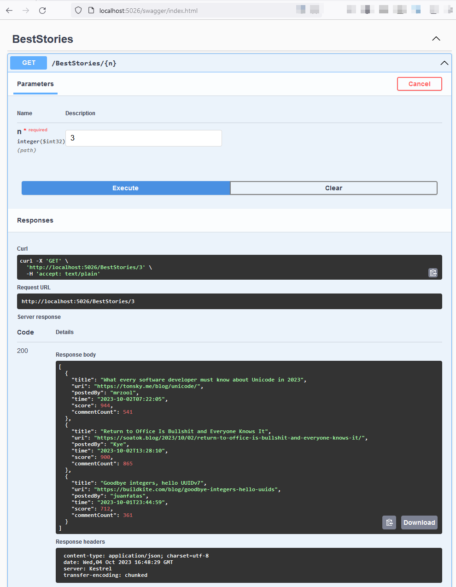
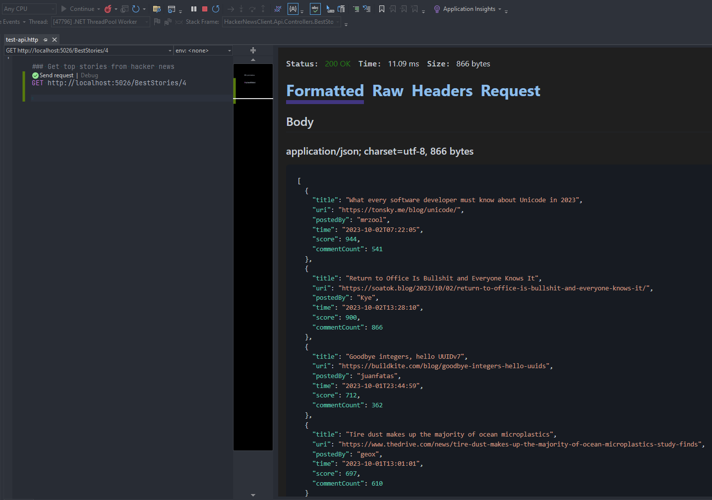

# HackerNewsClient API Client

This is a sample .NET Core RESTful API application

The application returns _best stories_ details from **Hacker News API** documented here: https://github.com/HackerNews/API.

The API returns array of first `n` _best stories_ sorted by their score in descending order.

It uses https://hacker-news.firebaseio.com/v0/beststories.json endpoint to get best stories IDs and https://hacker-news.firebaseio.com/v0/item/21233041.json endpoint to get details for each story.

The results are cached locally.

Framework: .NET Core 7.0

Application entry point: `./HackerNewsClient.sln`

Swagger URL: http://localhost:5026/swagger/index.html

Endpoint URL: http://localhost:5026/BestStories/4

## Assumptions

1. No authorization required
1. API should be able to efficiently service large numbers of requests without risking overloading of the Hacker News API
    - To achieve this, two levels of caching were added:
        - Caching request on API call level using `InMemoryCache` - for https://hacker-news.firebaseio.com/v0/item/21233041.json endpoint based on ID.
        - All requests received from Hacker News API (top 200) are cached in local database (SQLite) and can be read locally instead of API, but only if cache is not expired.
1. Application can be configured without changes in code
    - Hacker News API URLs in settings
    - Database connection string in settings
    - Cache expiration configured in settings
1. Based on the documentation from https://github.com/HackerNews/API, for the `/v0/beststories` endpoint, there is no guarantee the items are sorted based on score. That's why we read all 200 stories returned by the endpoint and then fetch their details, to be able to sort them by score locally, in the local database.
1. Unit test skipped for now, because I focused on good API design with caching. I may add some example tests in future.
    - the only worth-testing class is `HackerNewsService`

## Testing the API
Prerequisites: open `HackerNewsClient.sln` in Visual Studio and then run (F5) `HackerNewsClient.Api` project

### Testing
1. **Swagger**: you can test requests via swagger web page: http://localhost:5026/swagger/index.html

1. **REST Client**: You can use built-in Visual Studio 2022 _REST Client_ with `.http` file - open attached file `test-api.http` and click _'Send request'_ for the example request.

